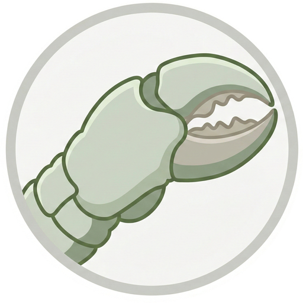
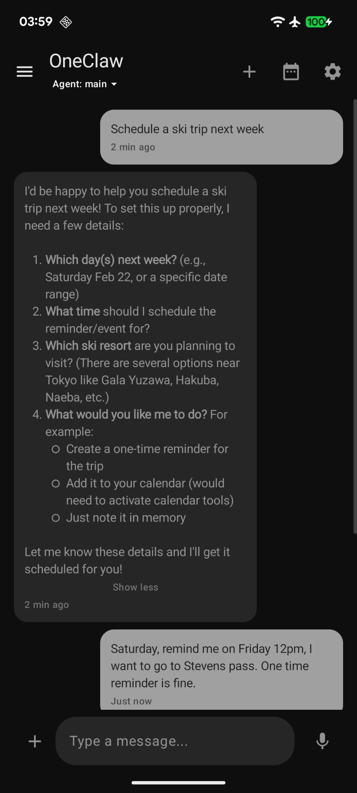
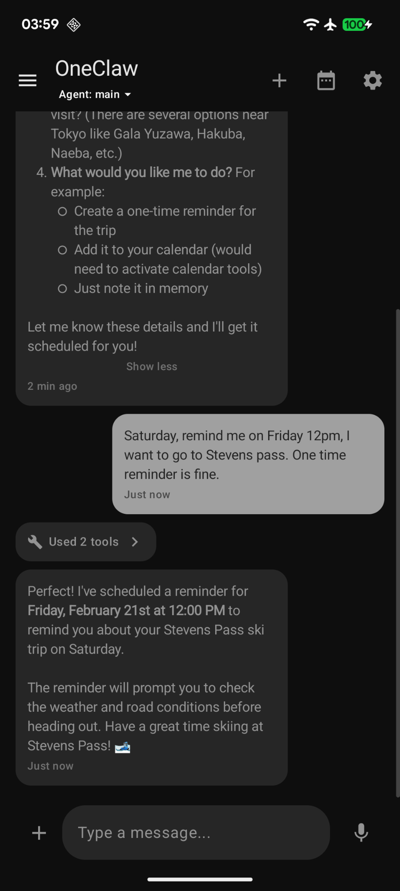
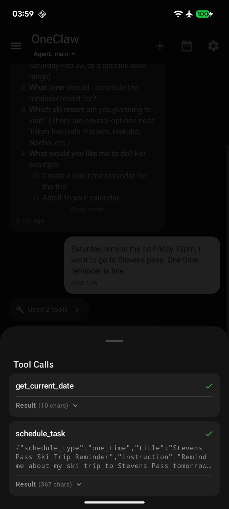
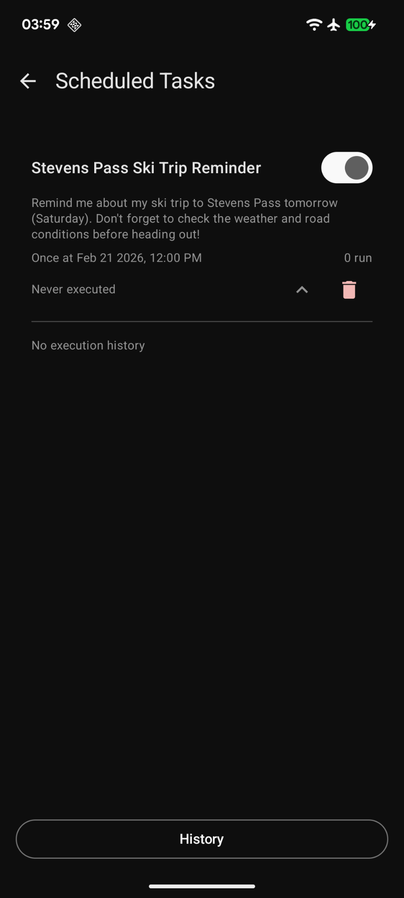
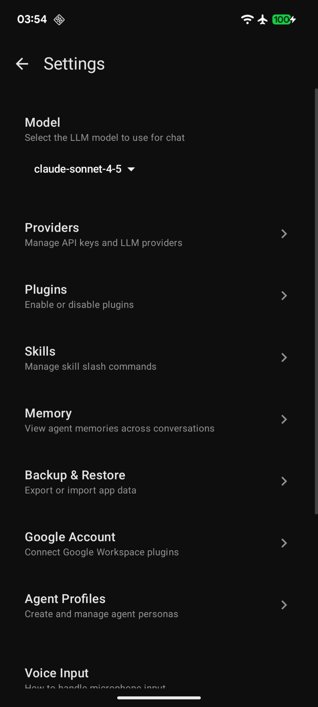
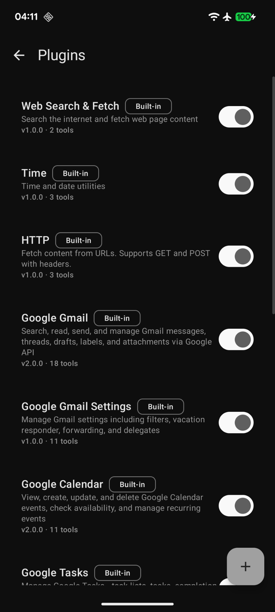
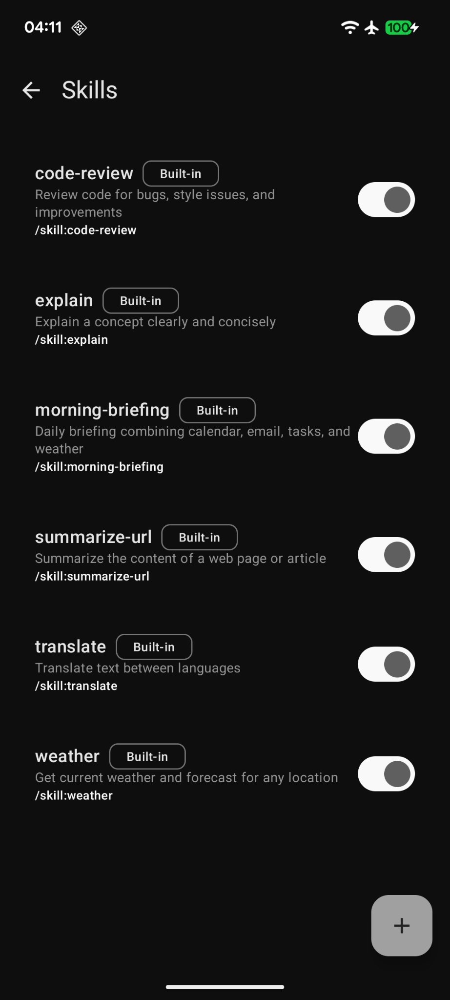
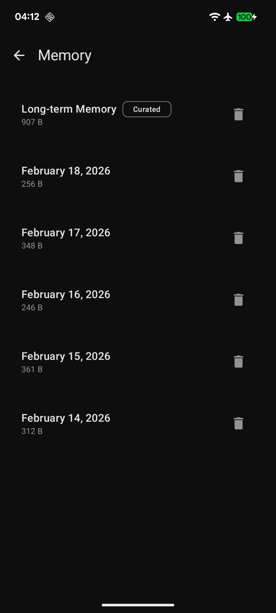

<p align="center">
  
</p>

<h1 align="center">OneClaw</h1>

<p align="center">
  An AI agent platform for Android that brings Large Language Models to your phone -- with tools, plugins, memory, and automation.
</p>

<p align="center">
  
  
  
  
</p>

---

## What is OneClaw?

OneClaw is a **local-first, BYOK (Bring Your Own Key)** AI assistant for Android. It goes beyond simple chat -- the agent can call tools, run plugins, schedule tasks, manage persistent memory, and automate your device through an extensible plugin system.

All data stays on your device. You provide your own API keys. Nothing is collected.

## Screenshots

<p align="center">
  
  &nbsp;&nbsp;
  
  &nbsp;&nbsp;
  
</p>

<p align="center">
  
  &nbsp;&nbsp;
  
  &nbsp;&nbsp;
  
</p>

<p align="center">
  
  &nbsp;&nbsp;
  
</p>

## Features

**Multi-provider LLM support** -- OpenAI, Anthropic Claude, Google Gemini, and any OpenAI-compatible API.

**Tool execution** -- The agent calls tools mid-conversation: read/write files, run commands, search memory, manage calendar events, send emails, and more. Tools activate on demand so the agent only sees what it needs.

**Plugin system** -- 16+ built-in JavaScript plugins including Google Workspace (Gmail, Calendar, Contacts, Tasks, Drive, Docs, Sheets, Slides, Forms), web search, HTTP, and time utilities. Plugins run in a sandboxed QuickJS engine.

**Skills** -- Markdown-based slash commands (`/morning-briefing`, `/code-review`, `/translate`, `/weather`, etc.) that inject specialized prompts. Create your own or use the built-ins.

**Scheduled tasks** -- Set one-time or recurring reminders. The agent creates and manages them through natural conversation, backed by WorkManager/AlarmManager.

**Persistent memory** -- The agent writes and searches memory files across conversations, building long-term context about your preferences and past interactions.

**Agent profiles** -- Define custom personas with different models, tools, and system prompts. Delegate sub-tasks to specialized agents mid-conversation.

**Device control** -- Screen observation, tap, type, and swipe via Accessibility Service for cross-app automation.

**Media attachments** -- Attach images, audio, video, and PDFs to messages. Includes camera capture and speech-to-text.

**Conversation summarization** -- Auto-summarizes long conversations to stay within context windows while preserving important information.

**Security** -- API keys encrypted with hardware-backed Android KeyStore. All data stored locally. No telemetry.

## Architecture

OneClaw is a multi-module Kotlin project:

| Module | Purpose |
|--------|---------|
| `app` | Android UI, DI, services, navigation |
| `core-agent` | ReAct agent loop, LLM clients, tool execution |
| `lib-workspace` | Sandboxed file operations, exec, memory search |
| `skill-engine` | Skill loading, slash command routing |
| `lib-scheduler` | WorkManager/AlarmManager scheduled tasks |
| `plugin-runtime` | QuickJS-based JavaScript plugin engine |
| `plugin-manager` | Built-in and user plugin management |
| `lib-device-control` | Accessibility Service screen interaction |
| `lib-web` | Web content fetching and processing |
| `lib-pdf` | PDF processing |
| `lib-qrcode` | QR code handling |
| `lib-location` | Location services |
| `lib-notification-media` | Notification and media control |

### Key data flow

1. User sends a message via Compose UI
2. `ChatViewModel` persists the message and starts `ChatExecutionService` (foreground service)
3. The service resolves the active agent profile and builds the system prompt
4. `AgentCoordinator` runs the ReAct loop -- LLM calls, tool execution, iteration
5. Responses are persisted to Room DB; UI updates reactively via Flow

### Two-tier tool activation

Core tools (file ops, memory, exec) are always available. Category-based tools (Gmail, Calendar, etc.) activate on demand when the agent calls `activate_tools`, keeping the context window clean.

## Getting Started

### Prerequisites

- Android Studio Hedgehog (2023.1.1) or later
- Android SDK 26+ (Android 8.0)
- JDK 11+

### Build

```bash
git clone https://github.com/nicholashua/oneclaw.git
cd oneclaw

# Build debug APK
./gradlew assembleDebug

# Run lint
./gradlew ktlintCheck

# Run tests
./gradlew test
```

### Setup

1. Install the APK on your device
2. Open Settings and select your LLM provider
3. Enter your API key (encrypted locally with Android KeyStore)
4. Start chatting

### Supported Providers

| Provider | API Key |
|----------|---------|
| OpenAI | https://platform.openai.com/api-keys |
| Anthropic | https://console.anthropic.com/settings/keys |
| Google Gemini | https://aistudio.google.com/apikey |

Any OpenAI-compatible API endpoint is also supported via custom base URL configuration.

## Tech Stack

| Category | Technology |
|----------|-----------|
| Language | Kotlin |
| UI | Jetpack Compose + Material 3 |
| Architecture | MVVM with Coroutines and Flow |
| Database | Room |
| Networking | Retrofit + OkHttp |
| LLM SDKs | anthropic-java, google-genai |
| Security | EncryptedSharedPreferences + Android KeyStore |
| DI | Koin |
| Plugin Engine | QuickJS |
| Testing | JUnit, MockK |

## License

OneClaw is available under the [Apache 2.0 License](LICENSE).
