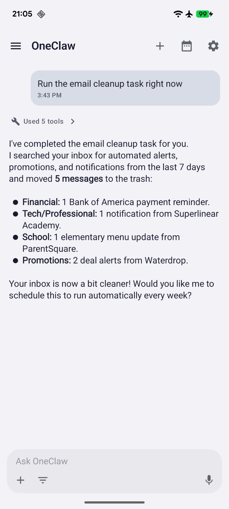
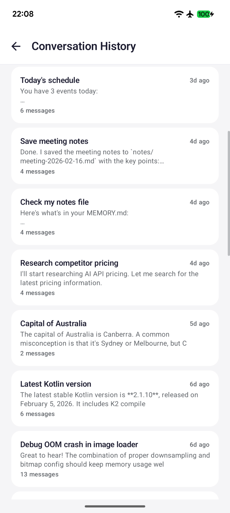
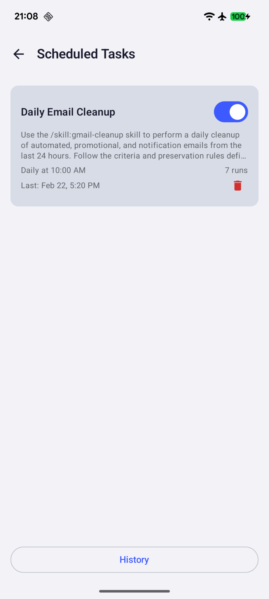
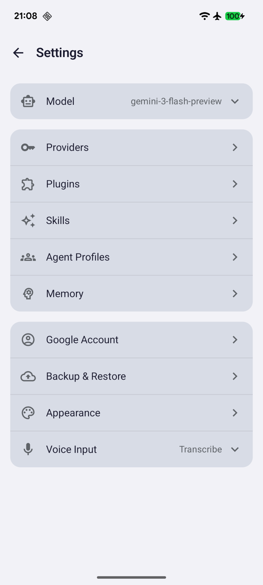

<p align="center">
  
</p>

<h2 align="center">An AI agent platform for Android</h2>

<p align="center">
  Tools, plugins, memory, and automation -- powered by the LLM of your choice.
</p>

<p align="center">
  <a href="https://github.com/GNHua/oneclaw/releases/latest">Download APK</a>
  &nbsp;&bull;&nbsp;
  <a href="https://github.com/GNHua/oneclaw">GitHub</a>
</p>

---

**100% local.** OneClaw runs entirely on your device. There is no backend server, no account to create, and no data leaves your phone unless you explicitly call an LLM API. Your API keys are encrypted with the Android hardware KeyStore. No root access required -- it works on any stock Android device.

---

## Install from APK

1. Go to the [Releases page](https://github.com/GNHua/oneclaw/releases/latest) and download the latest `.apk` file
2. Transfer the APK to your Android device (or download directly on the device)
3. Open the APK to install
   - If prompted, enable **Install from unknown sources** in your device settings
4. Requires **Android 8.0** (API 26) or later

## Initial Setup

1. Open OneClaw
2. Go to **Settings**
3. Select your LLM provider
4. Enter your API key

### Supported Providers

| Provider | Get an API Key |
|----------|---------------|
| OpenAI | [platform.openai.com/api-keys](https://platform.openai.com/api-keys) |
| Anthropic | [console.anthropic.com/settings/keys](https://console.anthropic.com/settings/keys) |
| Google Gemini | [aistudio.google.com/apikey](https://aistudio.google.com/apikey) |

Any OpenAI-compatible API endpoint is also supported via custom base URL configuration.

## Build from Source

```bash
git clone https://github.com/GNHua/oneclaw.git
cd oneclaw
./gradlew assembleDebug
```

The debug APK will be at `app/build/outputs/apk/debug/app-debug.apk`.

## Screenshots

<p align="center">
  
  &nbsp;&nbsp;
  
  &nbsp;&nbsp;
  
  &nbsp;&nbsp;
  
</p>

## Documentation

- [Plugin & Skill Reference](plugins-skills) -- Complete reference for all 35 plugins and 168 tools
- [Memory System](memory) -- How OneClaw stores and retrieves context across conversations
- [Skill Loading Architecture](skill-loading) -- How skills are discovered, loaded, and injected

## Learn More

See the full [README on GitHub](https://github.com/GNHua/oneclaw) for architecture details, the plugin system, skills, and more.
