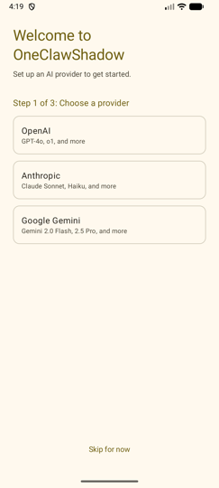
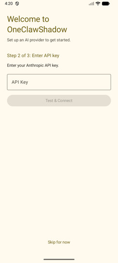
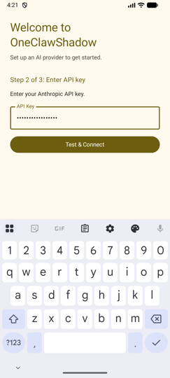
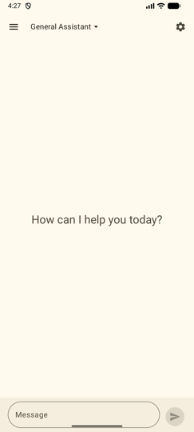
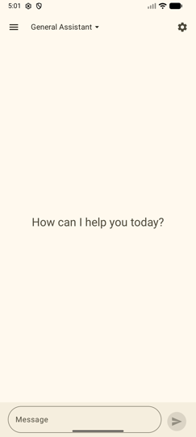
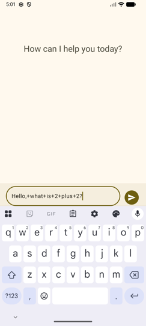
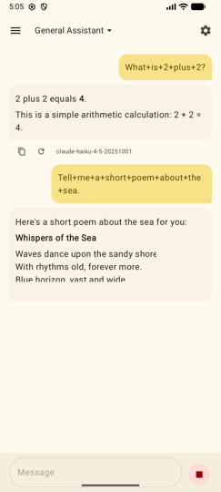
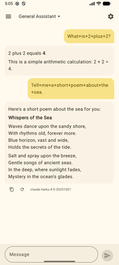

# 测试报告：第 1–3 阶段 — 项目基础 + RFC-003 + RFC-004

## 报告信息

| 字段 | 内容 |
|------|------|
| 覆盖阶段 | 第 1 阶段（项目基础）、第 2 阶段（RFC-003 Provider 管理）、第 3 阶段（RFC-004 Tool 系统） |
| 关联 FEAT | FEAT-003、FEAT-004 |
| Commits | `02e44d7`、`70a350f`、`10ebbbd`、`ca5e281`、`4dbe9c3` |
| 日期 | 2026-02-27 |
| 测试人 | AI (OpenCode) |
| 状态 | 完成 — 第二层 Chat 流程已全面验证 |

## 摘要

第 1–3 阶段完成了项目的完整基础架构、Provider 管理（RFC-003）和 Tool 系统（RFC-004）的实现。本报告涵盖第 3 阶段完成后执行的所有第一层测试。

| 层级 | 步骤 | 结果 | 备注 |
|------|------|------|------|
| 1A | JVM 单元测试 | 通过 | 181 个测试（包含所有已实现 RFC） |
| 1B | 设备 DAO 测试 | 通过 | 47 个 DAO 测试，在 emulator-5554 运行 |
| 1B | 设备 UI 测试 | 跳过 | 暂未编写 Compose androidTest |
| 1C | Roborazzi 截图测试 | 通过 | 5 张基线截图，已记录并验证 |
| 2 | adb 视觉验证 | 通过 | Flow 1（Setup）、Flow 5（数据注入）、Flow 6（Chat）均已验证 |

## 第一层 A：JVM 单元测试

**命令：** `./gradlew test`

**结果：** 通过

**测试数量：** 181 个测试，0 个失败

各 RFC 测试类分布：

**第 1 阶段（基础）：**
- `ModelApiAdapterFactoryTest` — 3 个测试
- `OpenAiAdapterTest`、`AnthropicAdapterTest`、`GeminiAdapterTest` — 适配器单元测试
- 各 model/repository 单元测试 — 第 1 阶段约 57 个测试

**RFC-003 Provider 管理：**
- `TestConnectionUseCaseTest` — 成功、无 API key、网络失败
- `FetchModelsUseCaseTest` — 获取+保存、失败时降级
- `SetDefaultModelUseCaseTest` — 成功、model 不存在、Provider 未激活
- `ProviderListViewModelTest` — 从 repository 加载 provider 列表
- `ProviderDetailViewModelTest` — 各操作的状态更新
- `FormatToolDefinitionsTest` — 3 个适配器的 tool 定义格式化

**RFC-004 Tool 系统：**
- `ToolRegistryTest` — 4 个测试：注册、检索、获取全部、按 ID 获取
- `ToolSchemaSerializerTest` — schema 序列化
- `ToolExecutionEngineTest` — 6 个测试：成功、未找到、不可用、超时、权限拒绝、异常捕获
- `GetCurrentTimeToolTest` — 3 个测试：默认时区、指定时区、无效时区
- `ReadFileToolTest` — 2 个测试：读取文件、文件不存在报错
- `WriteFileToolTest` — 2 个测试：写入文件、写入失败报错
- `HttpRequestToolTest` — 4 个测试：GET 请求、响应截断、网络失败、超时

## 第一层 B：设备端测试

**命令：** `ANDROID_SERIAL=emulator-5554 ./gradlew connectedAndroidTest`

**结果：** 通过

**设备：** 模拟器 `Medium_Phone_API_36.1`，Android 16，API 36

**测试数量：** 47 个测试，0 个失败

测试类：
- `AgentDaoTest` — 8 个测试
- `ProviderDaoTest` — 9 个测试（修复：方法名 `deleteCustomProvider`）
- `ModelDaoTest` — 8 个测试
- `SessionDaoTest` — 10 个测试
- `MessageDaoTest` — 7 个测试
- `SettingsDaoTest` — 5 个测试

**备注：** `ProviderDaoTest` 存在 Bug（调用了 `delete()` 而非 `deleteCustomProvider()`），已在 commit `4dbe9c3` 修复。

## 第一层 C：Roborazzi 截图测试

**命令：**
```bash
./gradlew recordRoborazziDebug
./gradlew verifyRoborazziDebug
```

**结果：** 通过

**测试文件：** `app/src/test/kotlin/com/oneclaw/shadow/screenshot/ProviderScreenshotTest.kt`

**配置说明：**
- 将 `compose.ui.test.junit4` 添加到 `testImplementation`（之前仅在 `androidTestImplementation`）
- 添加 `junit-vintage-engine` 运行时依赖，支持 JUnit 4 和 JUnit 5 共存
- 在测试类添加 `@Config(application = Application::class)`，绕过 Robolectric 环境下 `OneclawApplication.startKoin()` 重复启动问题
- 从 `ProviderListScreen` 中提取出公开的无状态 composable `ProviderListScreenContent()`

### 截图

#### SettingsScreen — 默认状态


视觉检查：顶部显示"Settings"标题和返回箭头，列表有"Manage Providers"条目，副标题"Add API keys, configure models"，右侧有箭头。布局清晰，符合预期。

#### ProviderListScreen — 已填充状态（3 个 Provider）


视觉检查：顶部"Providers"标题和"+"按钮，"BUILT-IN"分区标题，三行：OpenAI（4 个模型，红色"Disconnected"标签）、Anthropic（2 个模型，灰色"Not configured"标签）、Google Gemini（2 个模型，紫色"Connected"标签）。状态颜色符合 Material 3 主题。

#### ProviderListScreen — 加载状态


视觉检查：顶部"Providers"和"+"按钮可见，屏幕中央显示一个蓝色圆点（CircularProgressIndicator 初始帧）。加载状态正确。

#### ProviderListScreen — 空列表状态


视觉检查："Providers"标题，内容区域居中显示"No providers available."文本。空状态正确。

#### ProviderListScreen — 深色主题


视觉检查：黑色背景，白色文字，"Anthropic"行显示紫色"Connected"标签。深色主题渲染正确。

## 第二层：adb 视觉验证

**结果：** 通过

**设备：** `emulator-5554`，Medium_Phone_API_36.1，Android 16，1080×2400

**数据注入方式：** `adb shell am instrument` 运行 `SetupDataInjector`（将 API key 写入 debug SharedPreferences + 向数据库 seed Provider 和模型数据）。

**Layer 2 测试期间发现并修复的 Bug：** 详见下方"发现的问题"第 6–13 条。

### Flow 1 — Setup 第 1 步：选择 Provider



视觉检查："Welcome to OneClawShadow"标题显示为 gold/amber 主色，"Step 1 of 3: Choose a provider"步骤标题同样为主色。背景为暖米色（`surfaceLight`）。三个 Provider 卡片（OpenAI、Anthropic、Google Gemini）样式正确。底部"Skip for now"为 gold/amber 色。

### Flow 1 — Setup 第 2 步：输入 API Key（空状态）



视觉检查：标题和"Step 2 of 3: Enter API key"均显示为 gold/amber 主色。"Enter your Anthropic API key."为 `onBackground` 色。带"API Key"标签的边框输入框。"Test & Connect"按钮处于禁用状态。"Skip for now"为 gold/amber 色。

### Flow 1 — Setup 第 2 步：已输入 API Key



视觉检查：API key 已填入输入框，"Test & Connect"按钮变为激活状态（gold/amber 主色）。

### Flow 5 — 数据注入后直接进入 Chat（空状态）



视觉检查：通过 `adb instrument` 注入数据后，app 直接启动到 Chat 界面（跳过 Setup）。顶部显示"General Assistant"会话标题，屏幕中央显示"How can I help you today?"占位文字。底部输入栏，发送按钮为禁用状态。

### Flow 6 — Chat：空状态



视觉检查：Chat 空状态界面。"General Assistant"Agent 名称、设置图标、汉堡菜单。底部消息输入框和禁用的发送按钮（灰色）。

### Flow 6 — Chat：已输入消息



视觉检查：输入框中已有文字。发送按钮激活（gold/amber 色）。

### Flow 6 — Chat：Streaming 中



视觉检查：用户消息气泡（gold/amber 色），AI 响应正在流式传输，部分文字已显示。发送按钮位置变为红色停止按钮（■）。Markdown 粗体文字在 streaming 过程中正确渲染。

### Flow 6 — Chat：响应完成



视觉检查：AI 完整响应已渲染（Markdown 格式：粗体标题、段落文字）。响应下方显示复制和重新生成按钮。显示模型 ID `claude-haiku-4-5-20251001`。发送按钮恢复（灰色，输入框为空）。停止按钮消失。

## 发现的问题

| # | 描述 | 严重程度 | 状态 |
|---|------|----------|------|
| 1 | `ProviderDaoTest` 中方法名错误：调用 `delete()` 而非 `deleteCustomProvider()` | 中 | 已在 `4dbe9c3` 修复 |
| 2 | `compose.ui.test.junit4` 未加入 `testImplementation`，导致 Roborazzi 测试编译失败 | 中 | 已在 `4dbe9c3` 修复 |
| 3 | Robolectric 每个测试方法都触发 `OneclawApplication.startKoin()`，引发 `KoinAppAlreadyStartedException` | 中 | 已通过 `@Config(application = Application::class)` 在 `4dbe9c3` 修复 |
| 4 | `SetupScreen` 标题和步骤标题没有颜色（渲染为黑色）；应使用 `primary`（gold/amber） | 低 | 已在 RFC-001/002 实现后修复 |
| 5 | `OneClawShadowTheme` 默认 `dynamicColor = true`，在 Android 12+ 设备上用系统壁纸颜色覆盖 gold/amber 调色板 | 高 | 已修复：默认值改为 `false` |
| 6 | `BuildConfig.DEBUG` 未生成 — `app/build.gradle.kts` 缺少 `buildFeatures { buildConfig = true }` | 中 | 已修复：添加 `buildConfig = true` |
| 7 | Tool 定义 JSON 序列化错误：`formatToolDefinitions()` 使用 `v.toString()` 生成 Kotlin Map 语法 `{key=value}` 而非 JSON | 严重 | 已修复：在三个适配器中添加 `anyToJsonElement()` 辅助函数 |
| 8 | Message 和 Session ID 未生成：`MessageRepositoryImpl.addMessage()` 和 `SessionRepositoryImpl.createSession()` 收到 `id = ""` 时未生成 UUID，导致所有记录互相覆盖 | 严重 | 已修复：在两个 Impl 类中添加 `UUID.randomUUID()` 回退逻辑 |
| 9 | `SseParser.asSseFlow()` 使用 `callbackFlow` + `source().buffer()`，在非 IO dispatcher 上 `source.exhausted()` 立刻返回 true（读取 0 行） | 严重 | 已修复：改写为 `channelFlow` + `withContext(Dispatchers.IO)` + `byteStream().bufferedReader()` |
| 10 | `SseParser.asSseFlow()` 在 `withContext` 之后调用 `awaitClose()`，导致流结束后 `channelFlow` 永远不完成 — `isStreaming` 永久卡在 `true` | 严重 | 已修复：移除 `awaitClose()` |
| 11 | 三个适配器用 `withContext(Dispatchers.IO) { body.asSseFlow() }.collect { emit(...) }` — 在 `flow {}` 内部从 IO dispatcher 调用 `emit`，违反 flow 不变量，`ResponseComplete` 永远不被 emit | 严重 | 已修复：移除 `withContext` 包裹（`asSseFlow()` 内部已处理 IO） |
| 12 | `AppDatabase` seed 数据使用不存在的模型 ID `claude-haiku-4-20250414`、`claude-sonnet-4-20250514` | 高 | 已修复：更新为 `claude-haiku-4-5-20251001`、`claude-sonnet-4-5-20250929`、`claude-opus-4-5-20251101` |
| 13 | `GenerateTitleUseCase.LIGHTWEIGHT_MODELS` 使用不存在的模型 ID `claude-haiku-4-20250414` | 中 | 已修复：更新为 `claude-haiku-4-5-20251001` |

## 变更历史

| 日期 | 变更内容 |
|------|----------|
| 2026-02-27 | 初始版本，覆盖第 1–3 阶段 |
| 2026-02-27 | 更新 Layer 2：新增 Setup 第 1、2 步的 adb 截图，记录颜色修复（问题 4、5） |
| 2026-02-27 | 完成 Layer 2：修复 8 个严重 Bug（问题 6–13），验证完整 Chat 流程（Flow 6），新增所有 Flow 6 截图 |
