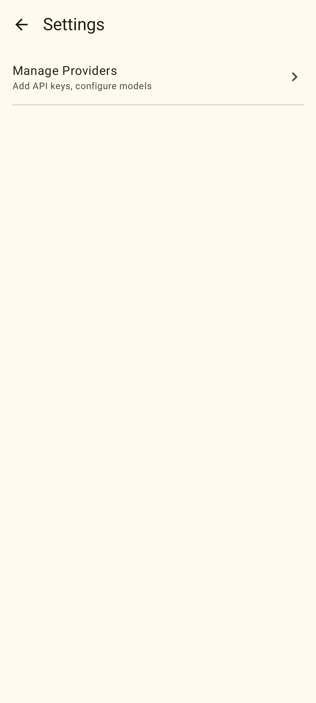
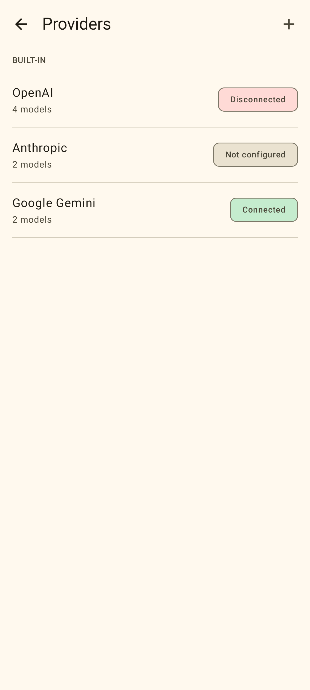
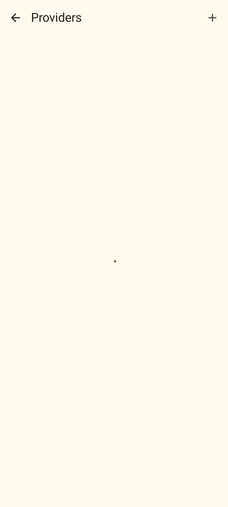
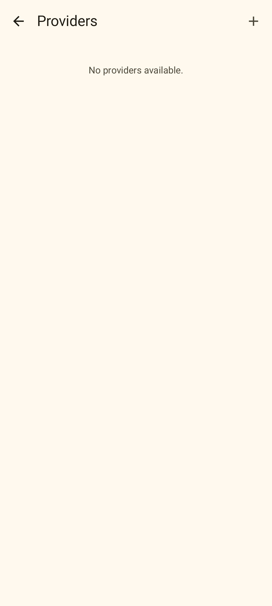
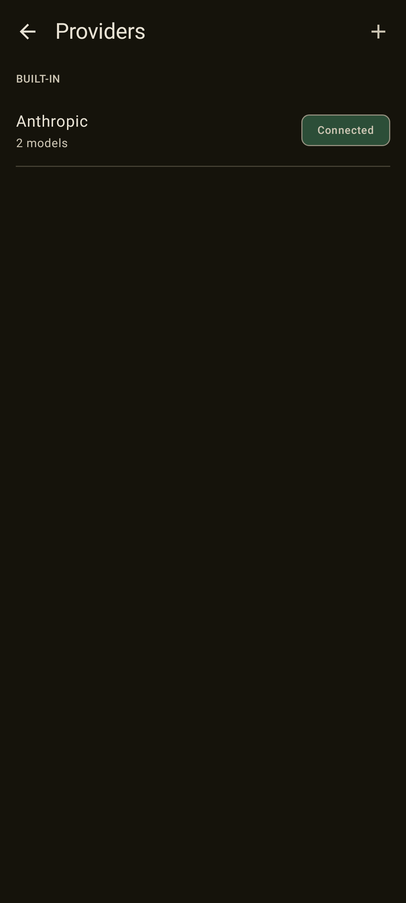
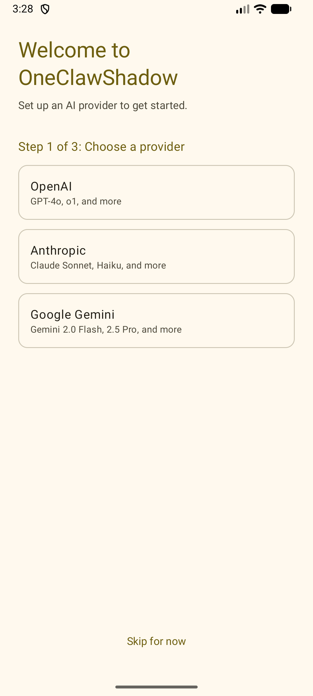
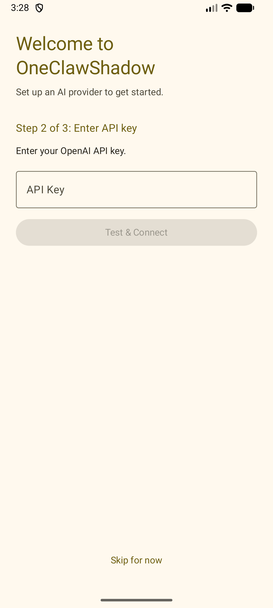

# Test Report: Phase 1–3 — Foundation + RFC-003 + RFC-004

## Report Information

| Field | Value |
|-------|-------|
| Phases covered | Phase 1 (foundation), Phase 2 (RFC-003 Provider Management), Phase 3 (RFC-004 Tool System) |
| Related FEATs | FEAT-003, FEAT-004 |
| Commits | `02e44d7`, `70a350f`, `10ebbbd`, `ca5e281`, `4dbe9c3` |
| Date | 2026-02-27 |
| Tester | AI (OpenCode) |
| Status | PARTIAL — Layer 2 skipped (Chat not yet implemented) |

## Summary

Phases 1–3 established the complete project foundation, implemented Provider Management (RFC-003) and the Tool System (RFC-004). This report covers all Layer 1 testing executed after Phase 3 completion.

| Layer | Step | Result | Notes |
|-------|------|--------|-------|
| 1A | JVM Unit Tests | PASS | 181 tests (includes all RFCs to date) |
| 1B | Instrumented DAO Tests | PASS | 47 DAO tests on emulator-5554 |
| 1B | Instrumented UI Tests | SKIP | No Compose androidTest written yet |
| 1C | Roborazzi Screenshot Tests | PASS | 5 baseline screenshots recorded and verified |
| 2 | adb Visual Flows | SKIP | Chat (RFC-001) not yet implemented; Flow 1 partially applicable but deferred |

## Layer 1A: JVM Unit Tests

**Command:** `./gradlew test`

**Result:** PASS

**Test count:** 181 tests, 0 failures

Test classes by RFC:

**Phase 1 (foundation):**
- `ModelApiAdapterFactoryTest` — 3 tests
- `OpenAiAdapterTest`, `AnthropicAdapterTest`, `GeminiAdapterTest` — adapter unit tests
- Various model/repository unit tests — ~57 tests at Phase 1 commit

**RFC-003 Provider Management:**
- `TestConnectionUseCaseTest` — success, no API key, network failure
- `FetchModelsUseCaseTest` — fetch + save, fallback on failure
- `SetDefaultModelUseCaseTest` — success, model not found, inactive provider
- `ProviderListViewModelTest` — loads providers from repository
- `ProviderDetailViewModelTest` — state updates for all actions
- `FormatToolDefinitionsTest` — tool definition formatting for all 3 adapters

**RFC-004 Tool System:**
- `ToolRegistryTest` — 4 tests: register, retrieve, getAll, getByIds
- `ToolSchemaSerializerTest` — schema serialization
- `ToolExecutionEngineTest` — 6 tests: success, not found, unavailable, timeout, permission denied, exception
- `GetCurrentTimeToolTest` — 3 tests: default timezone, specific timezone, invalid timezone
- `ReadFileToolTest` — 2 tests: reads file, error on missing
- `WriteFileToolTest` — 2 tests: writes file, error on failure
- `HttpRequestToolTest` — 4 tests: GET request, truncation, network failure, timeout

## Layer 1B: Instrumented Tests

**Command:** `ANDROID_SERIAL=emulator-5554 ./gradlew connectedAndroidTest`

**Result:** PASS

**Device:** Emulator `Medium_Phone_API_36.1`, Android 16, API 36

**Test count:** 47 tests, 0 failures

Test classes:
- `AgentDaoTest` — 8 tests
- `ProviderDaoTest` — 9 tests (fixed: `deleteCustomProvider` method name)
- `ModelDaoTest` — 8 tests
- `SessionDaoTest` — 10 tests
- `MessageDaoTest` — 7 tests
- `SettingsDaoTest` — 5 tests

**Note:** `ProviderDaoTest` had a bug (`delete()` called instead of `deleteCustomProvider()`). Fixed in commit `4dbe9c3`.

## Layer 1C: Roborazzi Screenshot Tests

**Commands:**
```bash
./gradlew recordRoborazziDebug
./gradlew verifyRoborazziDebug
```

**Result:** PASS

**Test file:** `app/src/test/kotlin/com/oneclaw/shadow/screenshot/ProviderScreenshotTest.kt`

**Setup notes:**
- Added `compose.ui.test.junit4` to `testImplementation` (was only in `androidTestImplementation`)
- Added `junit-vintage-engine` runtime dep to allow JUnit 4 + JUnit 5 coexistence
- Added `@Config(application = Application::class)` to bypass `OneclawApplication.startKoin()` in Robolectric
- Extracted `ProviderListScreenContent()` as a public stateless composable from `ProviderListScreen`

### Screenshots

#### SettingsScreen — default



Visual check: "Settings" title in top bar, back arrow navigation icon, "Manage Providers" list item with subtitle "Add API keys, configure models" and right chevron. Layout is clean and correct.

#### ProviderListScreen — populated (3 providers)



Visual check: "Providers" title, "+" add button in top bar, "BUILT-IN" section header, three rows: OpenAI (4 models, red "Disconnected" chip), Anthropic (2 models, grey "Not configured" chip), Google Gemini (2 models, purple "Connected" chip). All status chip colors are correct per Material 3 theme.

#### ProviderListScreen — loading state



Visual check: "Providers" title and "+" button visible, single blue dot in center of screen (CircularProgressIndicator captured at its initial frame). Correct loading state behavior.

#### ProviderListScreen — empty state



Visual check: "Providers" title, "No providers available." text centered in the content area. Correct empty state.

#### ProviderListScreen — dark theme



Visual check: Black background, white text, "Anthropic" row with purple "Connected" chip. Dark theme renders correctly.

## Layer 2: adb Visual Verification

**Result:** PARTIAL — Setup screens verified after RFC-001/RFC-002 completion

**Updated:** After all RFCs were implemented (commit `bdea03c`), the Setup flow was verified on the emulator.

**Bug found and fixed:** The `SetupScreen` title "Welcome to OneClawShadow" and step headers ("Step 1/2/3 of 3") had no explicit color, rendering in the default `onBackground` black. Fixed by setting `color = MaterialTheme.colorScheme.primary` on these texts.

**Second bug found and fixed:** `OneClawShadowTheme` had `dynamicColor = true` by default, causing Android 12+ devices/emulators to override the gold/amber palette with the system wallpaper color (emulator default: blue). Fixed by changing default to `dynamicColor = false`.

### Flow 1 — Setup Step 1: Choose Provider



Visual check: "Welcome to OneClawShadow" title in gold/amber primary color, "Step 1 of 3: Choose a provider" step header also in primary color. Background is warm cream (`surfaceLight`). Three provider cards (OpenAI, Anthropic, Google Gemini) with correct outlined style. "Skip for now" in gold/amber at the bottom.

### Flow 1 — Setup Step 2: Enter API Key



Visual check: Title and "Step 2 of 3: Enter API key" in gold/amber primary. "Enter your OpenAI API key." in `onBackground`. Outlined text field with "API Key" label. "Test & Connect" button disabled (no key entered yet) shown in muted container color. "Skip for now" in gold/amber.

## Issues Found

| # | Description | Severity | Status |
|---|-------------|----------|--------|
| 1 | `ProviderDaoTest`: wrong method name `delete()` instead of `deleteCustomProvider()` | Medium | Fixed in `4dbe9c3` |
| 2 | `compose.ui.test.junit4` missing from `testImplementation`, causing Roborazzi test compile failure | Medium | Fixed in `4dbe9c3` |
| 3 | `OneclawApplication.startKoin()` called for each Robolectric test, causing `KoinAppAlreadyStartedException` | Medium | Fixed via `@Config(application = Application::class)` in `4dbe9c3` |
| 4 | `SetupScreen` title and step headers had no color (rendered black); should use `primary` (gold/amber) | Low | Fixed post-RFC-001/002 |
| 5 | `OneClawShadowTheme` defaulted to `dynamicColor = true`, overriding gold/amber palette on Android 12+ with system wallpaper color | High | Fixed post-RFC-001/002: default changed to `false` |

## Change History

| Date | Change |
|------|--------|
| 2026-02-27 | Initial report covering Phase 1–3 |
| 2026-02-27 | Updated Layer 2: added adb screenshots for Setup steps 1–2, documented color fixes (issues 4 and 5) |
